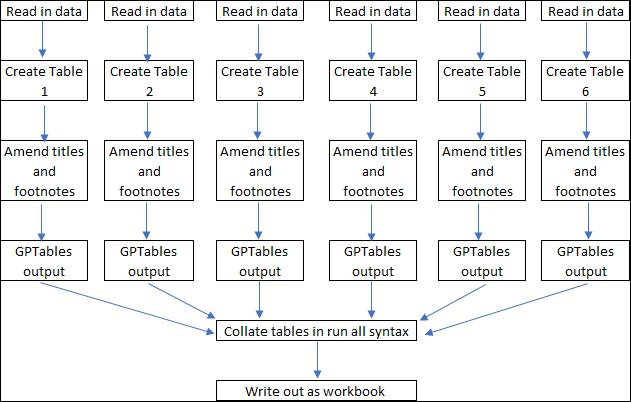
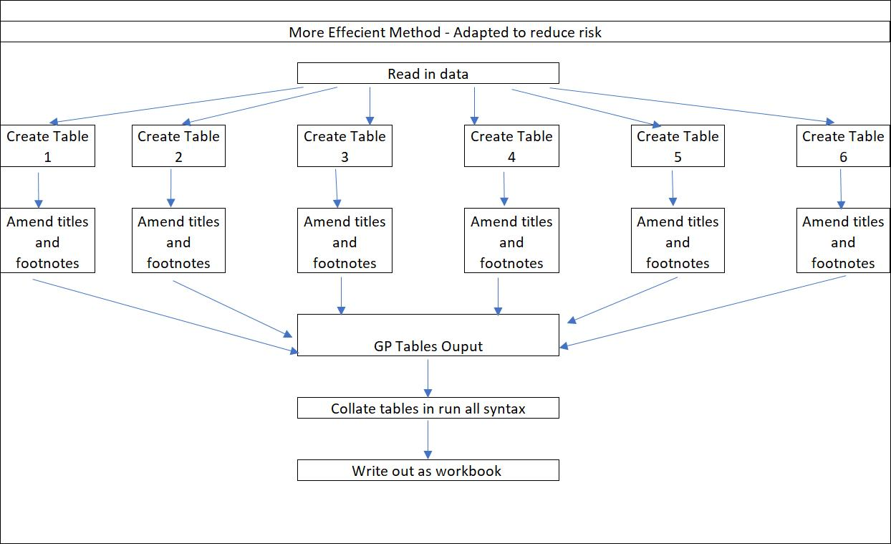

.. _doc.pipeline:

*******************
Python Architecture
*******************

This section covers how the NoC Python pipeline runs from start to finish. It will also talk about 
how to make amendments to the pipeline such as adding in a new table ot new suite of tables. 

------------------------------------------------------------------------

The Pipeline
============

Initial development work on the pipeline involved creating scripts independant of each other and 
replicating attemptibng to run off tables that matched the NoC tables that have previously been 
published. This meant that the pipeline ran very similarly to how we run off the SPSS outputs, where 
each table in each suite of tables has its own syntax and outputs. 

This method was time consuming, so we moved to a more efficient method. We only wanted to perform certain 
functions once rather than multiple times, this led to us trying to group specific stages of the pipeline 
together. We also had to try and future proof the pipeline so any amendments would not make the process 
fall over.  

This is currently how the pipeline runs, we read in the data for each suite of tables, only retaining the 
variables used in analysis. We then run them through each individual script to perform the analysis and 
run each output through the GPtables package to apply formatting. We then bring them together at the end to 
output them as one complete workbook.

Reading in data
^^^^^^^^^^^^^^^

The first step of running the pipeline is to read in the data. As we currently hold the CSEW data in SPSS 
datasets, we must run it through some coversion code to output a CSV file that can then be read into the 
pipeline.

The conversion code has been developed outside of the team and works for both the NVF and VF data. 
There are no comprehensive instructions for running the code yet so if you need it run please see 
a member of the Python working group.

Writing Scripts
^^^^^^^^^^^^^^^

The next stage is to conduct your statistical analysis. For the NoC tables this involved using functions 
developed as part of the **Crimetables package**. Once you have the output form your analysis, we can now run it 
through the GPTables package to perform some standardised formatting

Output
^^^^^^
Once it has run through GPTables and has had all the footnotes, title and standard formatting applied, our tables 
are ready to be outputted (**IS THAT A WORD?!?!**). We can export the entire suite of tables into one workbook with 
a cover sheet using the added functionality of GPTables. We now have a complete set of tables.

Crimetables
===========

The crimetables package was developed by the crime statistics team to enable the analysis of CSEW data within Python. 
This package was specifically developed for this project so does not currently have functionality 
to perform all necessary statistical analysis for all crime outputs. As more people move to Python 
for statistical analysis the crimetables package will grow and develop.

GPTables
========

GPTables is a package developed by the Best Practice and Impact Team (BPI team). It is a package designed 
to incorporate all the best practice guidance into statistical data outputs and allows for this formatting to 
be applied consistently across all tables.

This package applies the best practice guidance as standard but also allows for specific formatting to be
applied to individual tables to take into account different needs, for example formatting a row in a dataframe 
as currency instead of number.

Documentation for `GPTables <https://github.com/best-practice-and-impact/gptables/blob/master/docs/source/doc.gptable.rst>`_

Crime theme
===========

GPTables allows for additional formatting and one way it does this is by allowing users to create a theme.
The crime theme is a .yaml file that contains all of the core formatting for the nature of crime tables. 
This file sets all the global formatting for the specific outputs. For example sets all cells in the 'data' 
section of the table to Arial 9 and all the footnotes to Arial 8. The crime theme is read into the gptables function 
and allows for consistent formatting across the whole suite of tables.

Mapping
=======

We use mapping in the NoC tables to apply the final table label we want to appear in the output.
It is essentially a lookup that contains list of all the variable names, labels and values alongside 
the table label. We then save this as a dictionary in Python and set up a key so each variable name 
and value correlate with a table label. This allows Python to apply the correct table label automatically 
across all the tables (as long as it is in the lookup file).

Link to `variable map <//FA1RVWAPXX333/Crime Statistics/Crime RAP project/Final code to publish/crime-tables-python/mapping>`_ 

Coding Standards
================

When developing code it is advisable to make it consistent with pre-existing Python code. 
It is advised that all code is written to a set standard. For example…

* all code is in lower case
* no spaces between variable names 
* use snake script (all lower case and connected with underscores)
* clear documentation explaining the scripts 
* code indented at correct levels
* spaces either size of mathematical symbols
* leaving one line at end of code.

